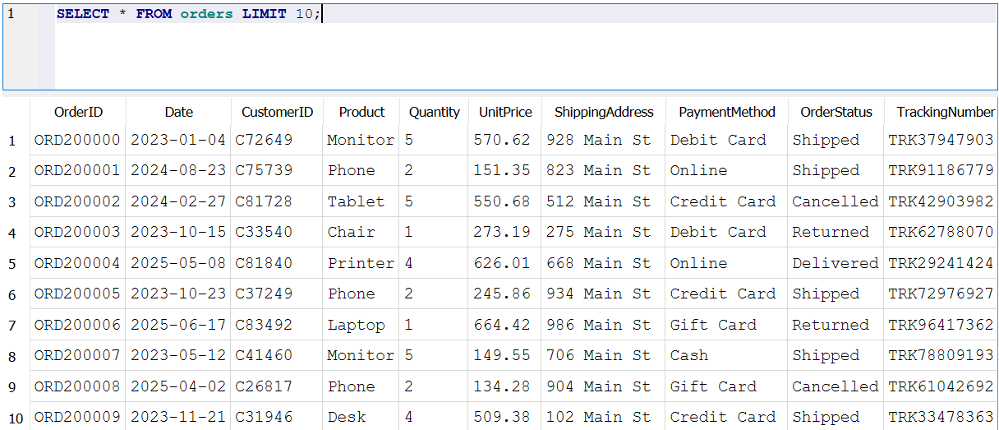
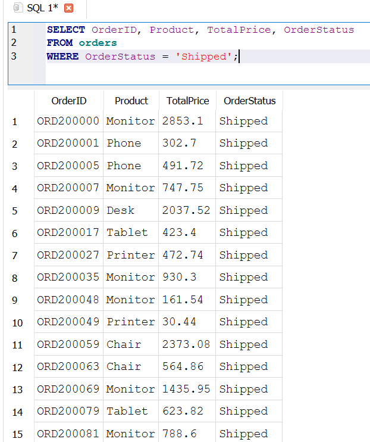
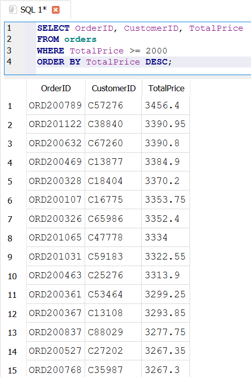
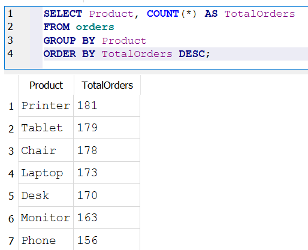
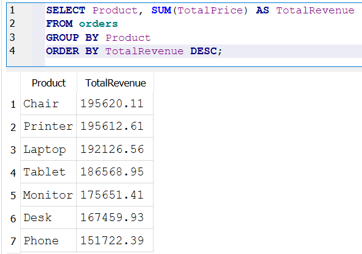
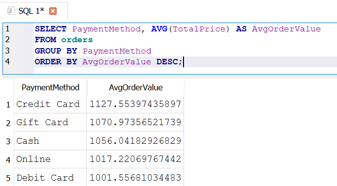
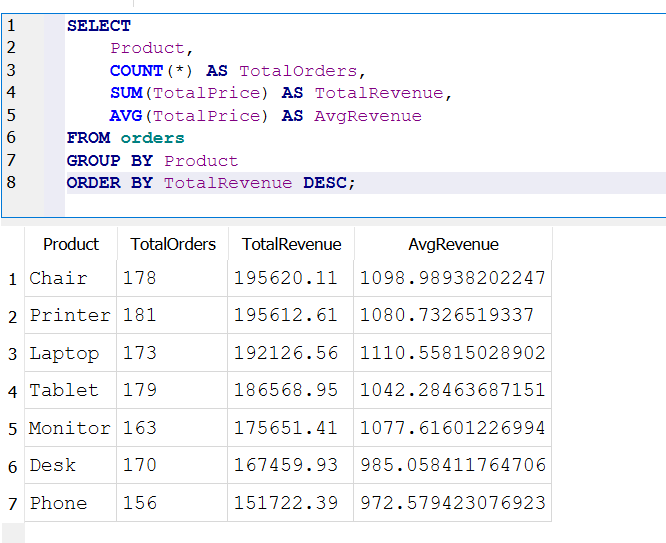

# Week 03 – Project 3: SQL Data Analysis

## Overview
This project demonstrates SQL Data Analysis using a real-world orders dataset. Queries were written using DB Browser for SQLite, covering SELECT, WHERE, ORDER BY, GROUP BY, and aggregation functions (COUNT, SUM, AVG).

---

## Screenshots

### 1. View All Data (SELECT * with LIMIT)

---

### 2. Filter by Order Status (WHERE)

---

### 3. High-Value Orders (WHERE + ORDER BY)

---

### 4. Orders Per Product (GROUP BY + COUNT)

---

### 5. Revenue Per Product (GROUP BY + SUM)

---

### 6. Average Order Value by Payment Method (GROUP BY + AVG)

---

### 7. Full Summary by Product (Multiple Aggregations)

---

## Key SQL Concepts Used

| Concept | Purpose |
|---|---|
| `SELECT` | Choose which columns to display |
| `WHERE` | Filter rows before grouping |
| `ORDER BY` | Sort the final results |
| `GROUP BY` | Collapse rows into categories |
| `COUNT()` | Count number of records |
| `SUM()` | Total up numeric values |
| `AVG()` | Calculate average values |

---
