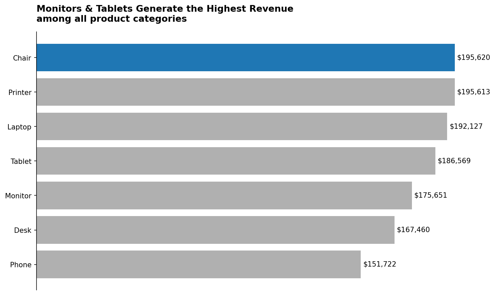
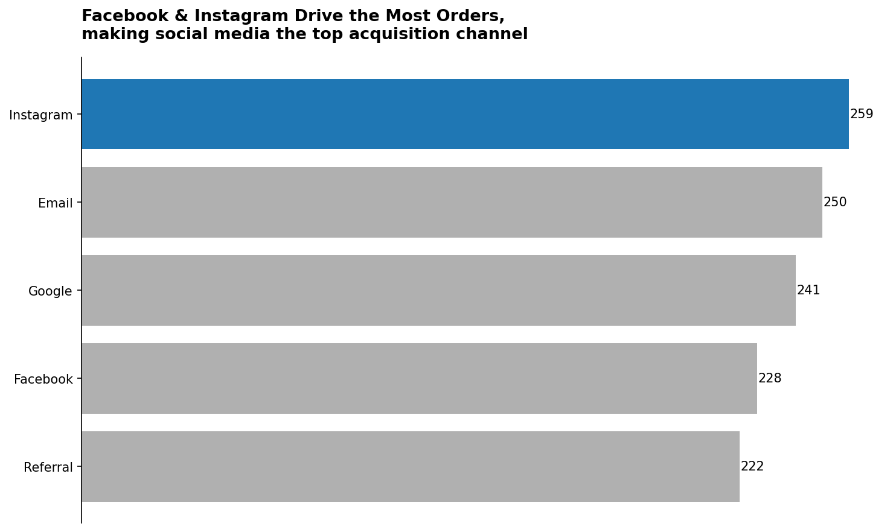
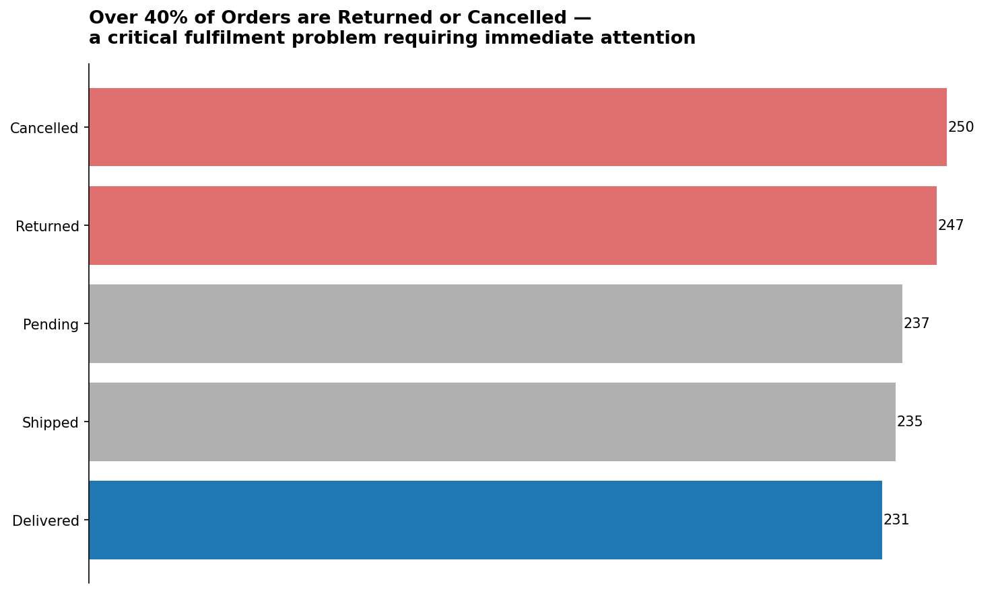
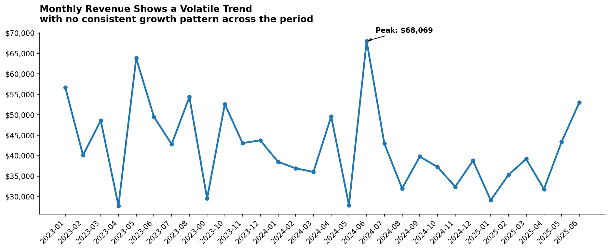

# Week 4 – Project 4: Data Visualization

## Overview
This is the Optional Mastery Phase of the DecodeLabs Data Analytics internship. The goal
was to create clear, insight-driven visual representations of the orders dataset using Python
(Matplotlib/Seaborn), applying professional data storytelling principles — choosing the right
chart type, maximizing the data-ink ratio, and writing action titles that state the conclusion.

---

## Dataset
**Source:** Cleaned dataset from Project 1 (`Cleaned_Dataset_Python.xlsx`)  
**Records:** 1,200 rows | **Columns:** 14

---

## Charts

### Chart 1 – Revenue by Product

**Chart Type:** Horizontal Bar Chart  
**Business Question:** Which product generates the most total revenue?  
**Insight:** Identifies the top-performing product by total sales value.

---

### Chart 2 – Orders by Referral Source

**Chart Type:** Bar Chart  
**Business Question:** Which referral source drives the most orders?  
**Insight:** Reveals which marketing channel is the most effective acquisition source.

---

### Chart 3 – Order Status Distribution

**Chart Type:** Bar Chart  
**Business Question:** What proportion of orders are Shipped, Cancelled, or Pending?  
**Insight:** Shows the operational health of order fulfillment across all statuses.

---

### Chart 4 – Monthly Revenue Trend

**Chart Type:** Line Chart  
**Business Question:** How has revenue trended over time?  
**Insight:** Tracks revenue growth or decline month-over-month to identify seasonal patterns.

---

## Design Principles Applied

| Principle | Application |
|---|---|
| Chart Selection Matrix | Bar for comparisons, Line for trends |
| Data-Ink Ratio | Removed gridlines, borders, and 3D effects |
| Zero-Baseline Axes | All bar charts start at 0 — no truncation |
| Direct Labeling | Values labeled on bars instead of relying on legends |
| Action Titles | Each chart title states the insight, not just the topic |
| Color as Spotlight | Single accent color used to highlight the key bar |

---

## Tools Used
- **Language:** Python 3
- **Libraries:** Pandas, Matplotlib, Seaborn
- **Environment:** Jupyter Notebook
